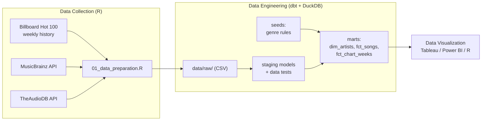
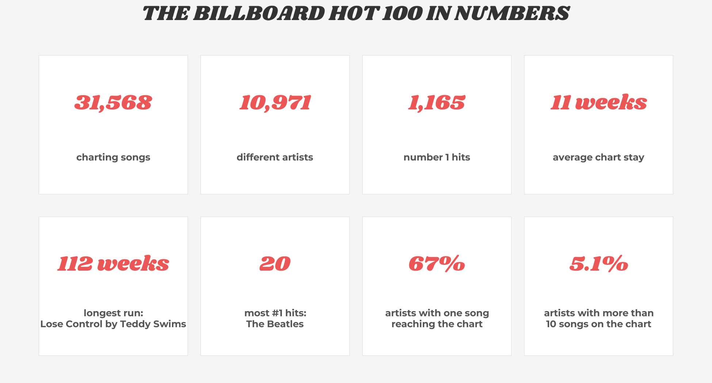
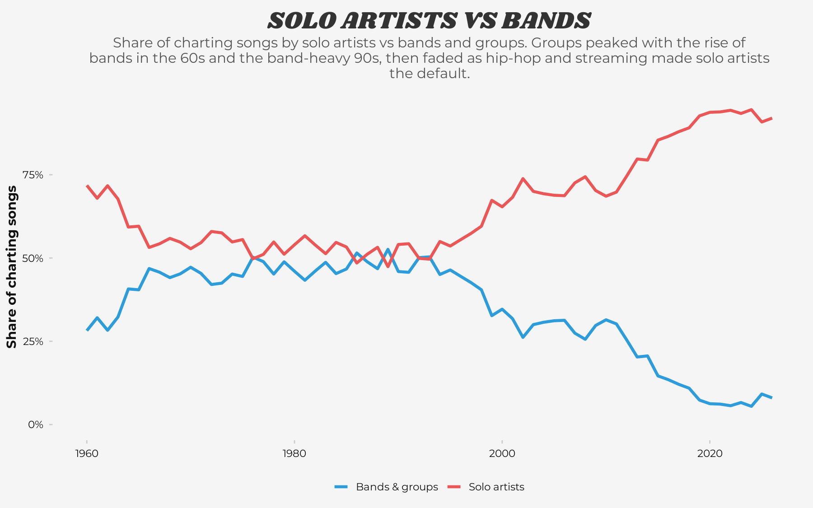
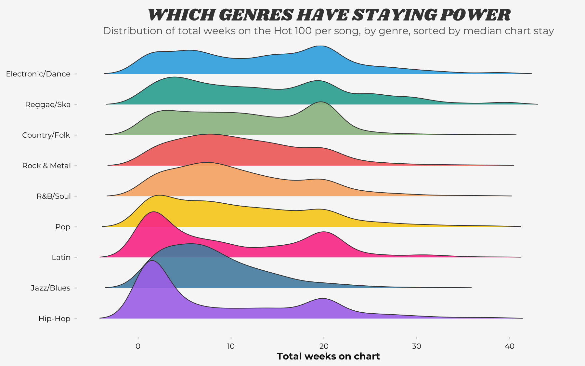
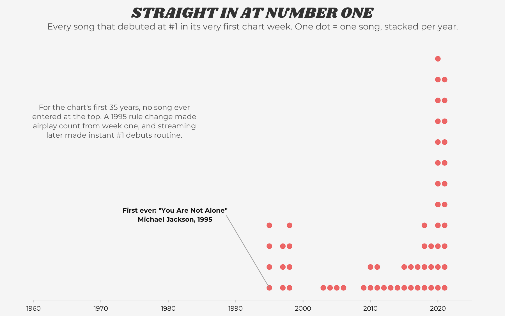
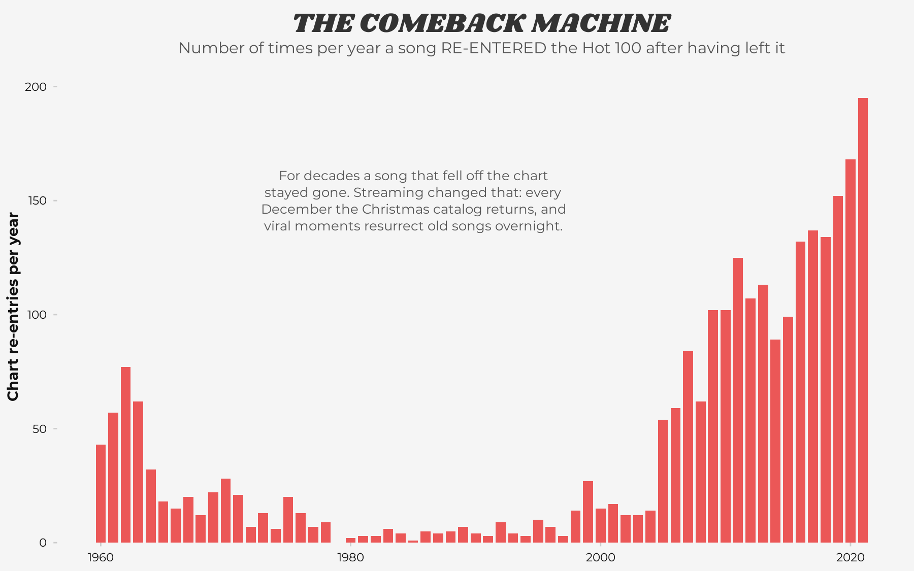
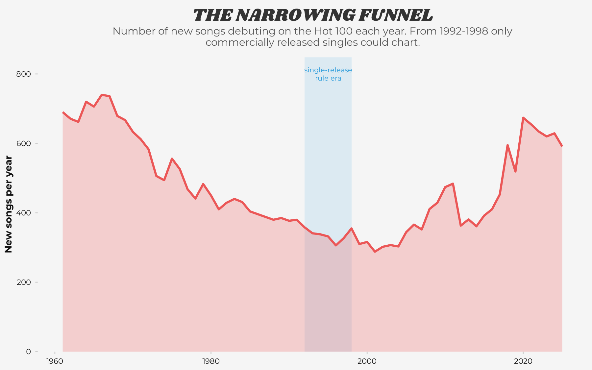
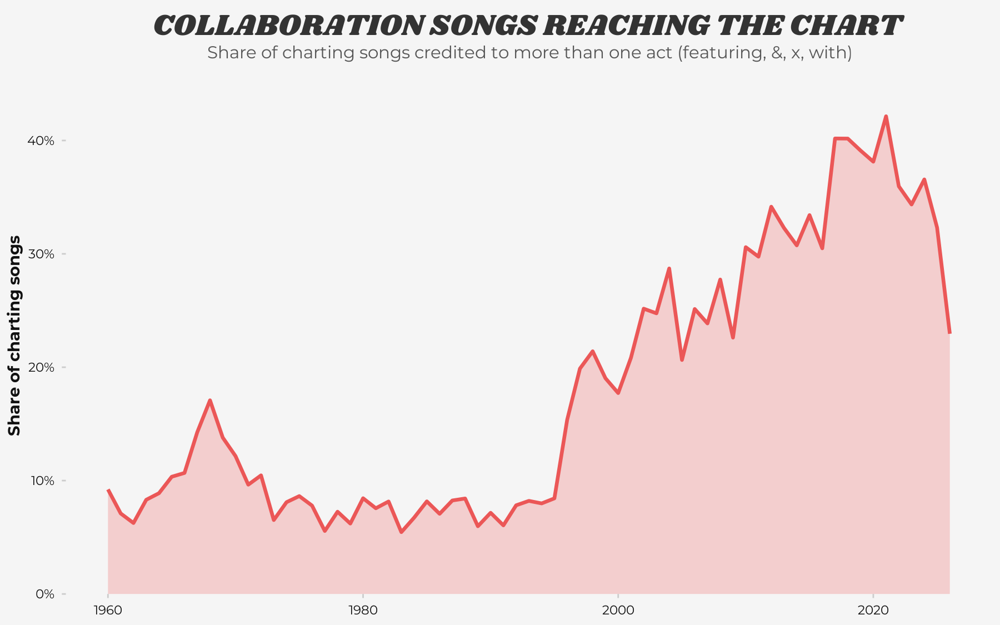
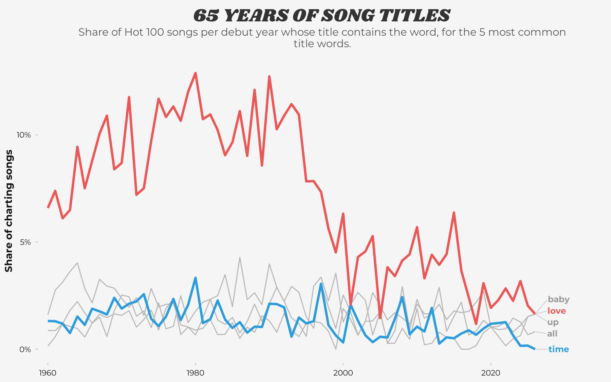
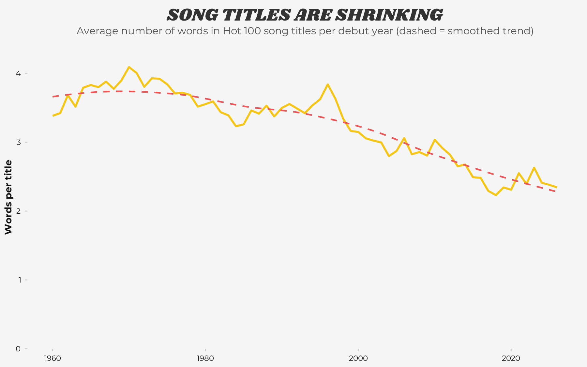

# Evolution of Mainstream Music - Billboard Hot 100 (1960-2025)

Tracking the evolution of mainstream music through data visualization (1960-2025).
The data is collected by scraping Billboard Hot 100 history and enriched with MusicBrainz and TheAudioDB APIs.
Data collection is done with R and Python. All transformations run in dbt on DuckDB, with data tests on every model. Visualizations are created in R (ggplot2) and [Tableau](https://public.tableau.com/app/profile/armin.talic/viz/EvolutionofMainstreamMusicBillboardHot100/EvolutionofMainstreamMusic).

## Table of Contents
* [Data Visualization](#data-visualization)
    * [Tableau Dashboard](#tableau-dashboard)
    * [Analysis](#analysis)
        * [The Hot 100 in Numbers](#the-hot-100-in-numbers)
        * [Longest-Running Hits](#longest-running-hits)
        * [The Rise of One-week Wonders](#the-rise-of-one-week-wonders)
        * [Solo Artists vs Bands](#solo-artists-vs-bands)
        * [Which Genres Have Staying Power](#which-genres-have-staying-power)
        * [Straight In at Number One](#straight-in-at-number-one)
        * [The Comeback Machine](#the-comeback-machine)
        * [The Narrowing Funnel](#the-narrowing-funnel)
        * [Collaboration Songs](#collaboration-songs)
        * [65 Years of Song Titles](#65-years-of-song-titles)
        * [Song Titles Are Shrinking](#song-titles-are-shrinking)
        * [Billboard Hot 100 Timeline Infographic](#billboard-hot-100-timeline-infographic)
* [Data Collection](#data-collection)
* [Data Engineering](#data-engineering)
    * [Data Model](#data-model)
    * [Data Quality & Testing](#data-quality--testing)

---

## Data Visualization

### Tableau Dashboard

Explore the interactive version of this visualization on Tableau Public. Hover over the genre waves to see the all-time top artists for each style, or use the timeline to filter the vinyl chart by decade.

[**Access the Interactive Tableau Dashboard Here**](https://public.tableau.com/app/profile/armin.talic/viz/EvolutionofMainstreamMusicBillboardHot100/EvolutionofMainstreamMusic)

---

### Analysis

#### The Hot 100 in Numbers

High level statistics of the dataset: everything that charted between 1960 and 2025.

  

---

#### Longest-Running Hits

A vinyl-styled visualization showing the artists with the highest "longevity" on Billboard Top 100; longevity is defined by total amount of weeks accumulated while the track is on the list.
Time is mapped around the vinyl's circumference, while the vinyl grooves serve as a scale for longevity; the further a bar extends outward, the longer that song stayed on the Hot 100.

  

---

#### The Rise of One-week Wonders

  

---

#### Solo Artists vs Bands

Yearly share of charting songs by solo artists compared to bands and groups. Groups held around half of the chart for decades before fading, as hip-hop and streaming made solo artists the default.

  

---

#### Which Genres Have Staying Power

Distribution of total weeks on chart per song and genre, sorted by median chart stay. Electronic and country hits linger the longest while hip-hop tracks come and go the fastest. The bump around week 20 reflects Billboard's recurrence rule that removes older songs falling below position 50.

  

---

#### Straight In at Number One

Every song that debuted directly at #1 in its first chart week. For the chart's first 35 years this never happened; a 1995 rule change and later streaming made instant #1 debuts routine.

  

---

#### The Comeback Machine

How often songs re-enter the Hot 100 after leaving it. Re-entries almost disappeared for decades and exploded in the streaming era, driven by the returning Christmas catalog and viral revivals.

  

---

#### The Narrowing Funnel

The number of new songs debuting on the chart each year. The funnel narrowed for decades and reopened in the streaming era; in the shaded 1992-1998 window only commercially released singles could chart.

  

---

#### Collaboration Songs

The share of charting songs credited to more than one act. Collaborations were a rarity until the 1990s and now account for roughly a third of the chart.

  

---

#### 65 Years of Song Titles

The share of songs whose title contains one of the five most common title words. "Love" dominated for four decades and fades steadily; "time" never goes out of fashion.

  

---

#### Song Titles Are Shrinking

Average number of words in song titles per debut year, falling from almost four words in the early 1970s to under two and a half today.

  

---

#### Billboard Hot 100 Timeline Infographic

The following visualizations break down 65 years of musical data into specific eras. Each dashboard shows the following metrics:

* **Top Artist:** The act maintaining the highest cumulative weeks on the Billboard Hot 100 chart per year.
* **Top Songs:** The longest-running #1 hit for every single year in the dataset.
* **Chart Velocity:** A density map showing the relationship between a song's Peak Rank (1-100) and its total weeks on chart.
* **Genres Wave:** A streamgraph showing the "Volume" or market share of the top genres over time. Thickness indicates higher popularity in the mainstream.
* **Genre Longevity:** A ridgeplot showing the distribution of "staying power" per genre.
* **Tempo Analysis:** A dynamic metronome showing the Average BPM (Beats Per Minute) for the era.

##### 1980s

  

##### Explore by Decade
*Click a decade below to expand the high-resolution dashboard.*

  
🔍 <strong>View 1960s</strong>
 
  

  
🔍 <strong>View 1970s</strong>
 
  

  
🔍 <strong>View 1980s</strong>
 
  

  
🔍 <strong>View 1990s</strong>
 
  

  
🔍 <strong>View 2000s</strong>
 
  

  
🔍 <strong>View 2010s</strong>
 
  

  
🔍 <strong>View 2020s</strong>
 
  

  
🔍 <strong>View All Time</strong>
 
  

---

## Data Collection

This project uses a multi-source data pipeline, integrating core historical chart data with dual API metadata enrichment. Collection scripts live in [data_collection/](data_collection/).

1. **Billboard Hot 100 History (Base Data)**
   * **Source:** [utdata/rwd-billboard-data](https://github.com/utdata/rwd-billboard-data)
   * Contains weekly performance from 1960 to present.

2. **Billboard Emerging Artists History**
   * **Source:** Custom Python web scraper using the `billboard.py` library.
   * Contains the complete weekly history of the Billboard Emerging Artists chart.

3. **MusicBrainz API (Core Metadata)**
   * Fetches demographics, band relations (solo vs group), and community-voted genre tags.

4. **TheAudioDB API (Supplemental Enrichment)**
   * Fallback for missing genre metadata and qualitative "Mood" attributes.

5. **GetSongBPM API (Tempo)**
   * Song-level BPM for long-career artists, powering the tempo/metronome visuals.

---

## Data Engineering

### Data Model

The pipeline is split into two layers:

| Layer | Tooling | What it does |
|---|---|---|
| **Collect** | R ([data_collection/01_data_preparation.R](data_collection/01_data_preparation.R)) | Downloads the weekly Hot 100 history and fetches metadata for every unique performer from the MusicBrainz and TheAudioDB APIs. The API pulls use cache-and-resume, so the multi-hour fetches never need repeating. Raw CSVs land in `data/raw/` unchanged. |
| **Transform** | dbt + DuckDB ([data_engineering/](data_engineering/)) | Staging models type and standardize the raw extracts. Seeds hold the genre-classification rules as plain CSV. Marts roll everything up to analysis-ready tables. |

Main models:

* `stg_billboard_weekly`: weekly chart grain, typed, with derived year/decade/new-entry flags
* `dim_artists`: one row per performer with the resolved parent genre and API metadata
* `fct_songs`: one row per song per chart year, with weeks on chart, peak position, genre and BPM
* `fct_chart_weeks`: weekly grain (1960+) materialized for BI tools

Classifying ~11,000 performers into 10 parent genres from messy community tags is the trickiest part of the project. The rules live in three dbt seeds (a tag blocklist, keyword rules, and artist-level overrides) so every rule is versioned, testable and reviewable as a plain CSV diff.

### Data Quality & Testing

Every model has dbt data tests (uniqueness, not-null, accepted ranges and values):

* Chart positions must fall in 1-100, BPM in 30-300, genre labels must belong to the 10-genre taxonomy.
* The uniqueness test on the weekly grain caught a real historical quirk: for 13 weeks in late 1990, "Unchained Melody" by The Righteous Brothers charted twice at the same time (the 1965 original and a 1990 re-recording, both revived by the film *Ghost*). The test warns on those 13 known rows and fails only if new duplicates ever appear.
